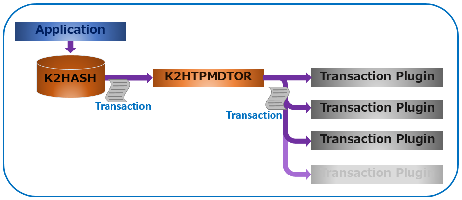

# Overview

This chapter describes the overview of **k2htp_mdtor**(aka **K2HTPMDTOR**).

**K2HTPMDTOR** is a shared library. Applications load it by calling the [K2HASH](https://k2hash.antpick.ax) library function. **K2HTPMDTOR** loads multiple [K2HASH](https://k2hash.antpick.ax) transaction plugins and passes transaction logs to them. Read [Details](details.html) page for details.

The following figure shows a data flow when an application updates a [K2HASH](https://k2hash.antpick.ax) file, which describes that:
1. An application updates some part of data in a [K2HASH](https://k2hash.antpick.ax) file.
2. [K2HASH](https://k2hash.antpick.ax) generates a transaction log and invokes a ****K2HTPMDTOR**(aka mdtor)**'s method with the log.
3. **K2HTPMDTOR** passes the log to transaction plugins.

[K2HASH](https://k2hash.antpick.ax) transaction plugins process a transaction log simultaneously or in sequence,  which is determined by **K2HTPMDTOR** settings.
**K2HTPMDTOR** can stop processing [K2HASH](https://k2hash.antpick.ax) transaction plugins if an error occurs in a prior plugin in a sequence, which is also determined by its settings. Read [Details](details.html) page about the settings.
