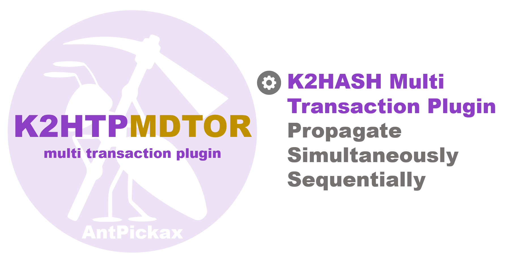

# K2HTPMDTOR

**k2htp_mdtor**(aka **K2HTPMDTOR**) is a [K2HASH](https://k2hash.antpick.ax) transaction plugin that handles [K2HASH](https://k2hash.antpick.ax) transaction logs. Once an application updates a [K2HASH](https://k2hash.antpick.ax) file, [K2HASH](https://k2hash.antpick.ax) generates a transaction log. **K2HTPMDTOR** receives it and passes it to other [K2HASH](https://k2hash.antpick.ax) transaction plugins.

The main purpose of **K2HTPMDTOR**, which loads multiple [K2HASH](https://k2hash.antpick.ax) transaction plugins, is to call the arbitrary function defined in them. When calling the each function, **K2HTPMDTOR** passes [K2HASH](https://k2hash.antpick.ax) transaction logs to it as a function's parameter. A common [K2HASH](https://k2hash.antpick.ax) transaction plugin loads no other one. We recommend you to use **K2HTPMDTOR** if you want to use multiple [K2HASH](https://k2hash.antpick.ax) transaction plugins. 

**K2HTPMDTOR** is designed to cooperate with subsystems. **K2HTPMDTOR** can pass a [K2HASH](https://k2hash.antpick.ax) transaction log to other transaction plugins simultaneously. This can help subsystems to track updates from an application very quickly.  

Read the following documents about **K2HTPMDTOR** for details.

## {{ page.arrow_link_overview }}

[Overview](home.html) page describes the **K2HTPMDTOR** overview.

## {{ page.arrow_link_details }}

[Details](details.html) page describes the **K2HTPMDTOR** initialization process and settings.

## {{ page.arrow_link_usage }}

[Usage](usage.html) page describes a **K2HTPMDTOR**'s example usage.

## {{ page.arrow_link_build }}

[Build](build.html) page instructs how to build the **K2HTPMDTOR** [source code](https://github.com/yahoojapan/k2htp_mdtor).

# **About AntPickax**

[AntPickax](https://antpick.ax/) is an open source project by [Yahoo Japan Corporation](https://about.yahoo.co.jp/info/en/company/).
